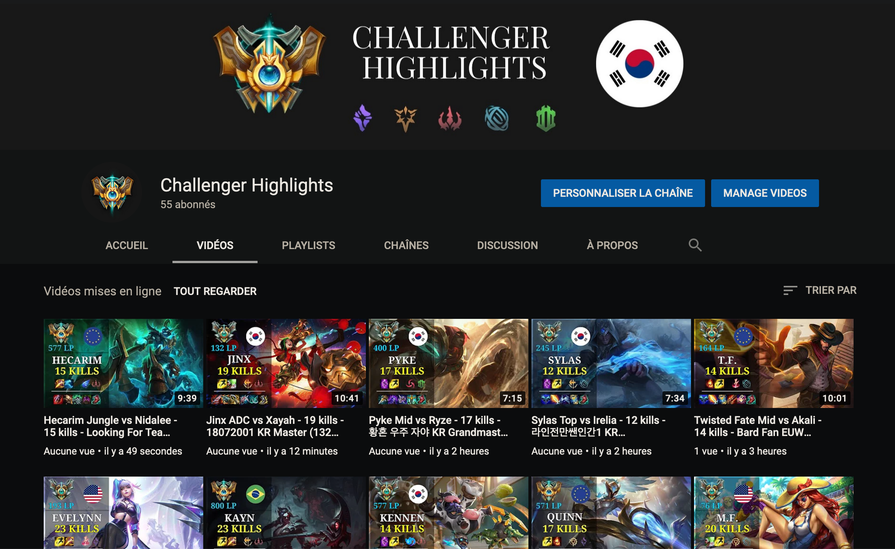
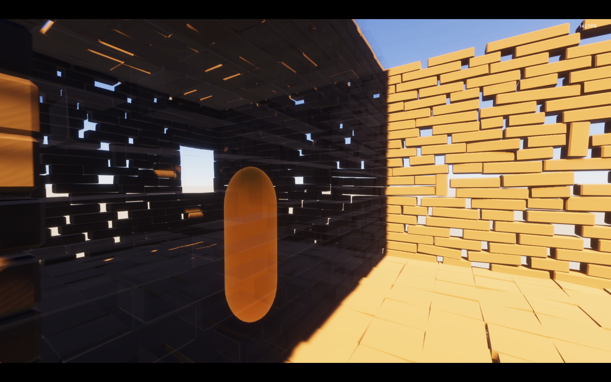
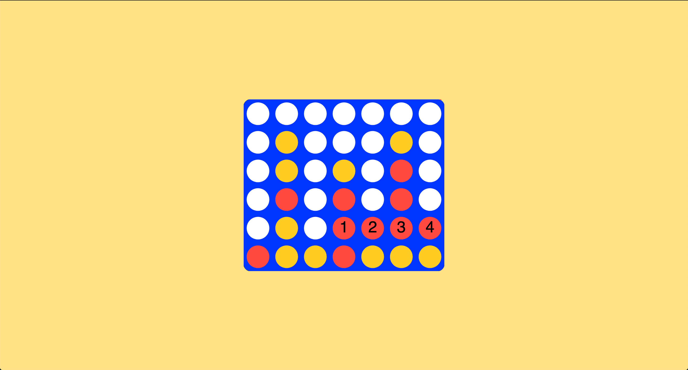
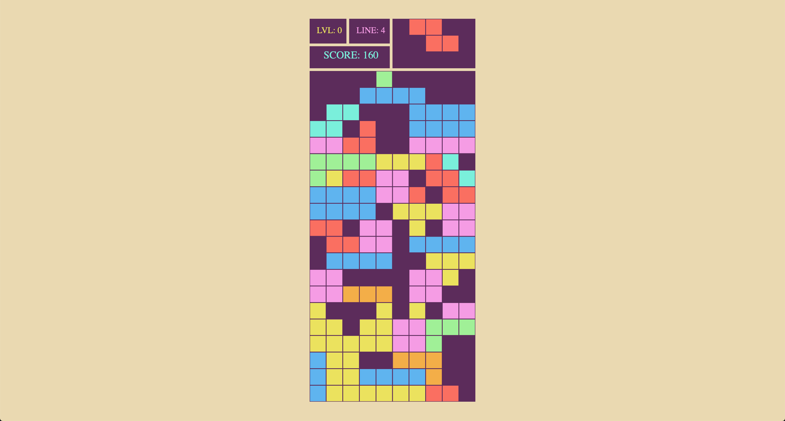
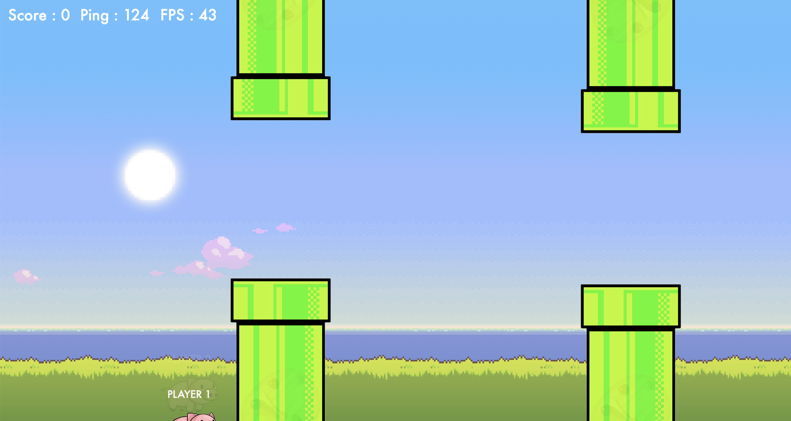

# Alexandre de Pape

Welcome to my portfolio.

There's nothing better than learning by doing, and the projects I've done taught me a huge amount of things about programming.

## Project 1 : League of Legends Highlights Creator and Uploader

I love League of Legends, so why not combine two things I love and learn interesting things at the same time?

Some Youtube channels upload games of high ELO players, but they are sometimes 50 minutes long and it takes a long time to watch. So I decided to improve the concept by creating and uploading the key moments of a match instead.

For this project, I had to learn how to open and close programs, send input keys to programs, create an algorithm that creates a ~5 minute video from a ~40 minute video with [moviepy](https://zulko.github.io/moviepy/) and how to upload and edit video on Youtube automatically.

The steps of the process are the following:

1. **Find** Challenger games not yet registered in the database (MongoDB). This is done by a microservice running 24 hours a day, 7 days a week: https://github.com/alexandredepape/RecordingsEnabler/tree/master.
2. **Scan** these games with the help of the Riot Games API and choose the **most relevant** player to watch by looking at kills, damage done, etc.
3. **Open** *League of Legends* and OBS Studio (https://obsproject.com/) and send inputs to **select** the player, **hide** the fog of war and **record** the game.
4. **Create** a 5-10 minute video from a 30-40 minute game, based on the timeline of events and their timestamps, such as kills, deaths, epic monsters, etc.
5. **Create** a thumbnail for the video based on metadata such as objects, deaths, runes, which will be uploaded with the video with PILLOW.
6. **Upload** the video to the **Challenger Highlights** *Youtube* channel: https://www.youtube.com/channel/UCz2zp337iZ9xkpLDACxpRHA

During this project I faced two huge challenges.

- The first challenge I faced was to reverse engineer and understand the Riot Games' spectator system. Once a game is running, people can watch it live. Once the game is over, it is no longer possible to watch it. To be able to watch a game after it's finished, websites like OPGG and Porofessor actually save the packets used to create the replay of a game. And once you have those packets, you can open the Spectator client at any time.
This was especially useful for me, because my system was based on watching the best possible games, and watching a game takes 30-40 minutes of real time, so a limited number of games can be watched per day.
Therefore, I had to find a clever solution to optimize this valuable time: I created a microservice that scans the challenger's ranking (high elo) to see if a player is currently at the start of a game, and if yes, sends a request to the third-party website to start recording packets in its database. I would then put the match ID into a mongoDB database to save the fact that I have the ability to watch that match later.
The main program on my desktop computer would then scan the database and retrieve information about completed matches, then choose the best match to watch.

- The second challenge I faced was actually uploading the video, because Youtube's API requires you to verify your "application" in order to put your video in public, otherwise it remains locked in private. Also, Youtube has a video upload limit that only allows you to upload about a dozen videos per day.
To solve this problem, I used Selenium to automate the upload through the browser itself. This solution allowed me to upload 50 videos per day.

For this project, I faced many challenges and had to think about a lot of different solutions and as a result, I got an automated youtube channel:

## Source code
- [https://github.com/alexandredepape/LeagueUploader](https://github.com/alexandredepape/LeagueUploader)

## Project 2 : Recreating the Fortnite Building Mechanics with Unity and C#

Fortnite's building system allows you to build walls, stairs, floors, and roofs, and offers a huge amount of gameplay possibilities.

Every time I played the game, I wondered how the system would know that I wanted to place a wall in that spot. So after a while, I decided to code it myself.

For this project, some of the challenges were:
- How to place the structures on an invisible construction grid.
- How to save the position of the structures so that you can't build in the same place twice.
- How to determine that a structure can be built because a connection is possible with another structure.
- How to recreate the structure editing system.

This project involved solving super interesting engineering problems and taught me a lot about 3D simulation and the math behind it like vectors and quaternions.
For the occasion, I also learned Blender and created 3D models to make the structures look good!

You can take a look at how it looks on this Youtube link:

<iframe width="560" height="315" src="https://www.youtube.com/embed/BhA5UkhAOMA" title="YouTube video player" frameborder="0" allow="accelerometer; autoplay; clipboard-write; encrypted-media; gyroscope; picture-in-picture" allowfullscreen></iframe>

## Project 3 : Connect 4 Monte Carlo Search Tree

This project consisted in learning how the **Monte Carlo Search Tree** ([MCTS](https://www.wikiwand.com/en/Monte_Carlo_tree_search)) algorithm works and how to implement it for Connect4. I had already implement the [Minimax](https://www.wikiwand.com/en/Minimax) for the game but wanted to go further.

I coded the frontend with the _Javascript_ library [PixiJS](https://www.pixijs.com/) that requests moves from an API written in _Golang_.

Both parts were deployed on the platform _Heroku_.

The game is playable at:

[https://connect4-vs-ai.herokuapp.com/](https://connect4-vs-ai.herokuapp.com/)

Try to beat the AI!

## Source code
- Frontend: [https://github.com/alexandredepape/connect4_frontend](https://github.com/alexandredepape/connect4_frontend)
- Backend: [https://github.com/alexandredepape/connect4_backend](https://github.com/alexandredepape/connect4_backend)

## Project 4 : Tetris

I was always interested about how the first video games were made, because their gameplay are so simple and so awesome at the same time. With Tetris, I was intrigued by how the game mechanics worked, the collision, the rotation of pieces, what would happen when you complete a line and so forth. To figure it out, I decided to code my own.

First written in Java, I rewrote the code in Javascript with the help of HTML Canvas to be able to deploy it on the web.

The game is playable at:

[https://pretty-tetris.herokuapp.com/html/solo.html](https://pretty-tetris.herokuapp.com/html/solo.html)

## Source code
- [https://github.com/alexandredepape/Tetris](https://github.com/alexandredepape/Tetris)

## Project 5 : Creating a multiplayer Flappy Bird in the Browser

I'm a competitive gamer and usually competitive game happen in a multiplayer scenario where players are synchronized across machines to a game state which occurs on a centralized server.

Because I like engineering problems, I had to learn how such a system works. As it turns out, **Game Networking** is a very hard engineering problem.
I chose to make a multiplayer mode of the famous game _Flappy Bird_, and called it Flappy Piggy Online.

During this project I had to learn about a lot of different networking techniques used in today's multiplayer game such as Counter Strike, Overwatch and Apex legends:
- Client prediction
- Server reconciliation
- Game loops
- Lag compensation

I built the server side in node.js and the client side with the Javascript library pixi.js

## Source code
- [https://github.com/alexandredepape/Flappypiggy-Multiplayer](https://github.com/alexandredepape/Flappypiggy-Multiplayer)

